# FaceWinUnlock-Tauri

**FaceWinUnlock-Tauri** 是一款基于 Tauri 框架开发的现代化 Windows 面容识别解锁增强软件。它通过自定义 Credential Provider (DLL) 注入 Windows 登录界面，结合前端 Vue 3 和后端 OpenCV 人脸识别算法，为用户提供类似 Windows Hello 的解锁体验。

## 下载地址 
[蓝奏云 密码:5969 推荐：不限速、不用登录、不用下载网盘](https://wwbqv.lanzoul.com/b019vlktwf) 

[百度云 提取码: 2ugj](https://pan.baidu.com/s/1UxEflXFxJN6wQBjBbwK9vw) 

[天翼云 访问码：u9gv](https://cloud.189.cn/t/FNvee2mQfumm)

[抖音ID: czm529797 提供的公益站点](https://download.mingqwq.top/)

## 📖 前言

这个项目的诞生源于一次小小的“心理落差”：

某天，公司新来的同桌入职了，他那台自带红外摄像头的笔记本每次开机只需“看一眼”就能秒进桌面。反观我手里这台性能拉满但摄像头不支持 Windows Hello 的设备，每天还要苦哈哈地敲那一串复杂的密码。

**“凭什么他能刷脸，我不行？”**

秉着“硬件不够，代码凑”的精神，我决定自己动手整一个。既然系统原生不支持普通摄像头面容解锁，那我就自己写一个注入 Windows 登录界面的组件。这就是 FaceWinUnlock-Tauri 的由来——为了让所有带摄像头的 Windows 设备都能体验到这份“优雅”。

## 📝 更新记录
| 版本号 | 更新日期 | 更新内容 | 备注 |
|--------|----------|----------|------|
| v0.1.0 | 2026-01-10 | 初始版本发布 | 支持基础面容录入、多账户解锁、系统初始化向导 |
| v0.1.1 | 2026-01-13 | Bug 修复 | 1. 修复用户名或密码错误时，点击磁贴进入无限循环的bug (#1) 2. 修复不显示页面磁贴时，解锁失败的问题 (#4)  **需要重新初始化**|
| v0.2.0 | 2026-01-19 | 功能添加、Bug修复 | 添加按操作调用面容代码的功能 添加面容识别失败后的重试功能(仅按操作生效) 添加面容禁用功能 (#10) 添加重试时间选项 添加静默自启选项 添加版本号显示 修复DLL设置显示磁贴不管用的bug (#15) 修复核心组件的线程无法安全退出的bug 修复核心组件重复创建凭证类的bug 修复每次修改面容后，缩略图会强制启用的bug 修复笔记本不插电源线时，自启失效的bug 可能修复了所有Win11自启不管用的bug (#16) (#17) 优化缩略图的显示状态提示 优化多开时的显示逻辑（会将程序设为焦点） **需要重新初始化**|
| v0.2.1 | 2026-01-21 | Bug修复、系统增强 | 修复自启不显示窗口的bug 修复在某部分系统上自启不显示托盘的bug 添加密码输入提示 修改重试时间最低为1秒 自启添加失败后的重试机制 **需要重新初始化**|
| v0.2.2 | 2026-01-26 | 功能添加、增强安全性，优化部分UI | 增加活体检测功能，模型使用通义实验室的[人脸活体检测模型-RGB](https://modelscope.cn/models/iic/cv_manual_face-liveness_flrgb/summary) 增加应用密码，需要密码才可进入应用，超过设定时间自动要求重新登录，增强安全性 优化一部分UI **需要重新初始化**|
---

## 📢 重要通知

> **风险预警：** 由于本项目涉及底层 **注册表修改** 及 **Winlogon 进程操作**，在极端情况下（如 DLL 崩溃、路径配置错误等）可能会导致 Windows 登录界面无法正常显示，甚至**导致无法进入系统桌面**。

> **建议：** 在部署前仔细阅读程序的弹窗通知，并拍照留档，以便出问题后恢复（虽然概率极小）

> **重要提示：** 密码请输入账户中的密码，非Pin码！很多用户是用Pin解锁的，然后在软件输入的Pin码，会提示账户或密码错误。**软件不支持Pin码，请输入账户密码**

> **如果多次提示密码错误，请卸载软件，不要使用，否则微软官方会锁定账户！**

---

## 🎯 适用范围与安全性说明

* **安全性警告**：本项目基于 **2D 面容识别** 技术。相比于 Windows Hello 的 3D 结构光或红外活体检测，2D 识别存在被照片、视频绕过的风险。
* **建议场景**：仅建议在**对安全性要求不高**、追求便捷体验的个人家用电脑或开发机环境使用。**严禁用于存储高机密数据的办公或服务器环境。**
* **系统环境**：Windows 10/11 64位系统（Win7 64位尚未测试）
* **注意事项**：请勿将本软件用于非法用途，如用于非法用途，请自行负责。
---

---

## 🛠️ 安装与使用

> 在开始之前，请确保你已经阅读并理解了顶部的 **风险预警**。

1. **第一步：系统初始化**
运行软件后，系统会自动检测摄像头权限及注册表环境。强烈推荐在第2步拍照留档，一旦出错方便恢复。
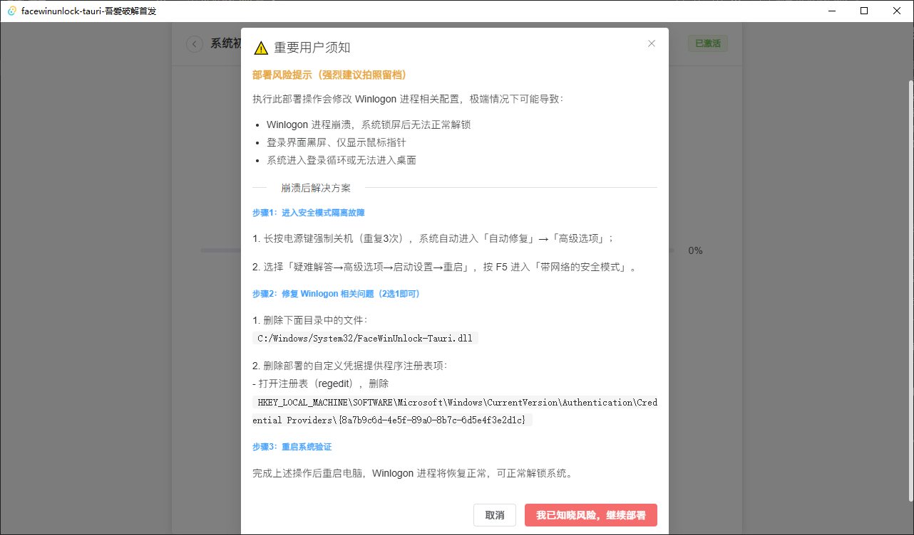
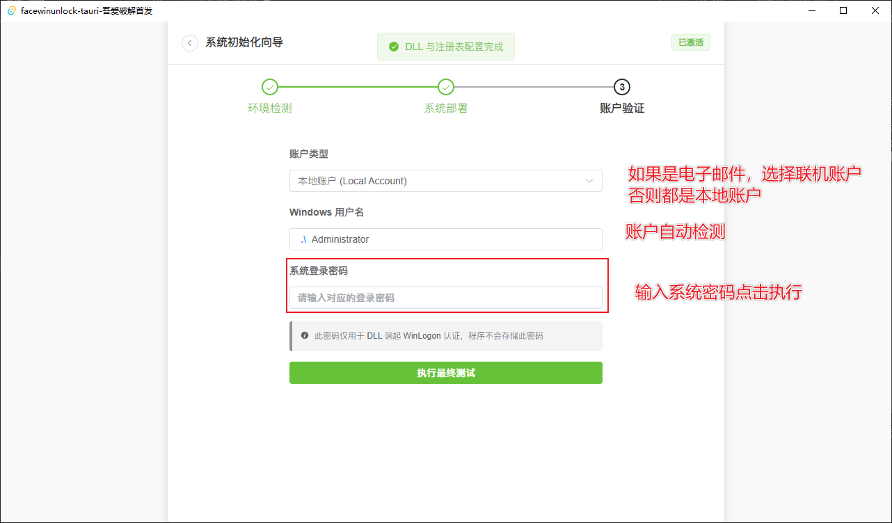
点击执行后，软件会锁定账户，5秒后自动解锁，请勿手动解锁。解锁成功即初始化完成。

2. **第二步：个性化设置**
初始化成功后，点击首选项，选择一个摄像头设备。
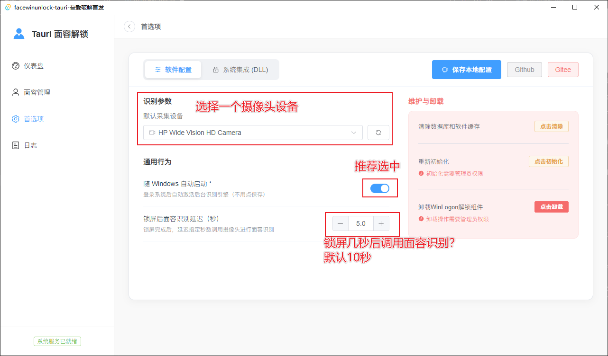
3. **第三步：面容录入**
点击面容管理->添加新面容，即可添加，图片如下：
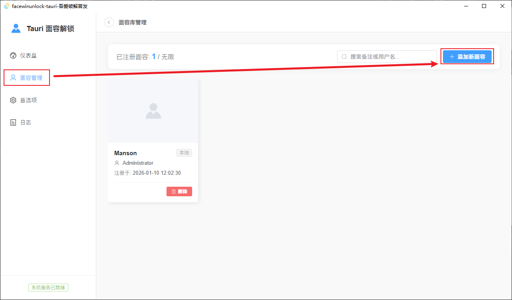
选择下面任意方式添加面容
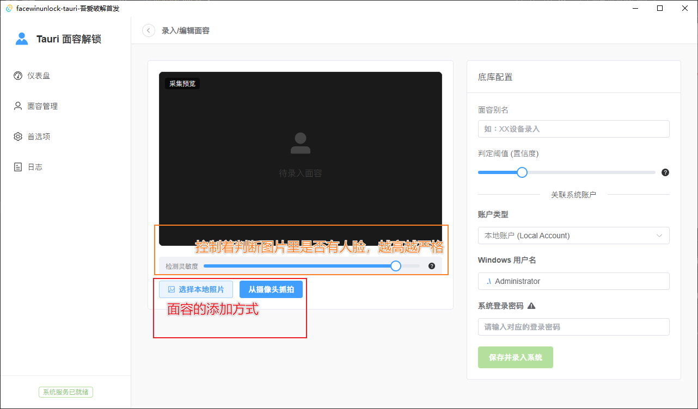
4. **第四步：关联账户**
上一步面容添加成功后，输入别名、Windows账户类型，用户名（自动检查）和密码，点击添加即可完成。
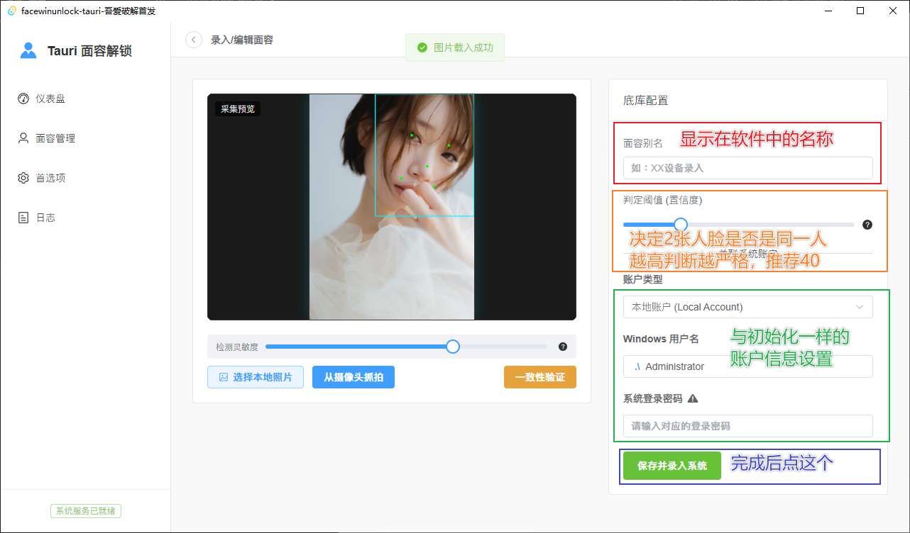
面容列表功能如下图：
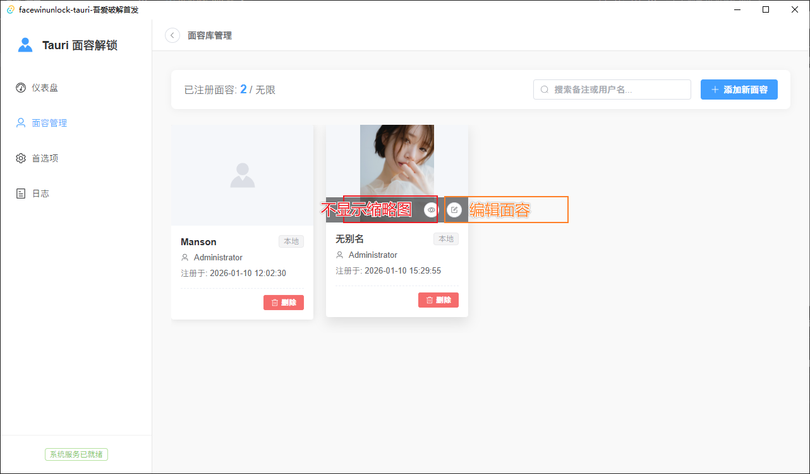
5. **第五步：测试**
按下 `Win + L` 锁定屏幕，滑动鼠标或按键盘（如果你选的延迟时间，请等待相应的秒数），将调用面容识别代码。
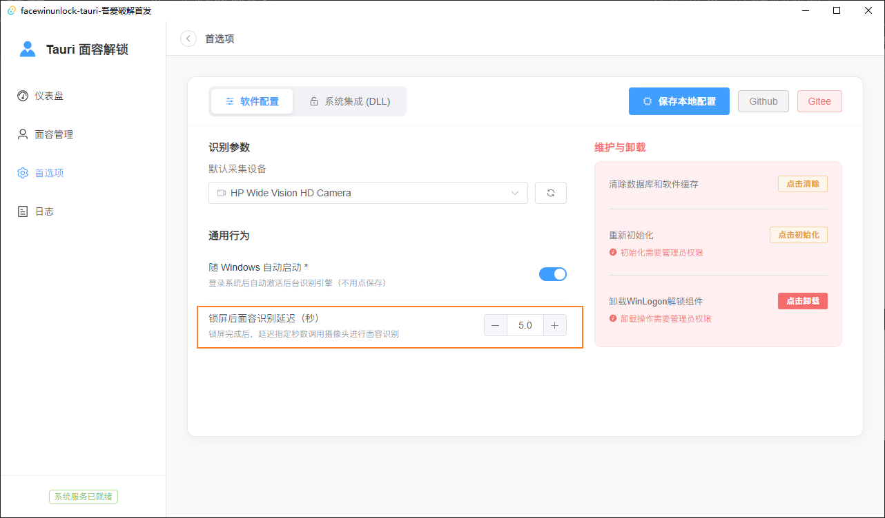
6. **第六步：卸载**
点击首选项->点击卸载核心组件（不走这一步，直接卸载软件会有残留）
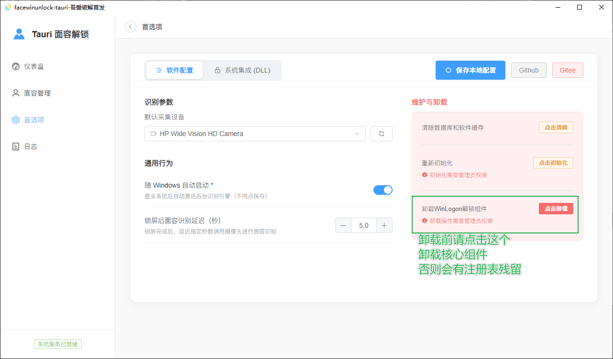
打开软件安装目录的 *uninstall.exe* 卸载主程序即可
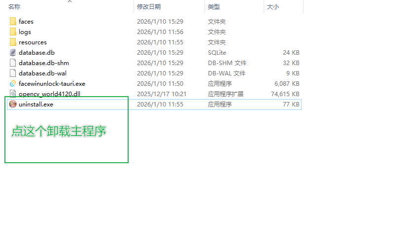
最后删除残留的数据库和日志文件，程序卸载完成，无残留文件。
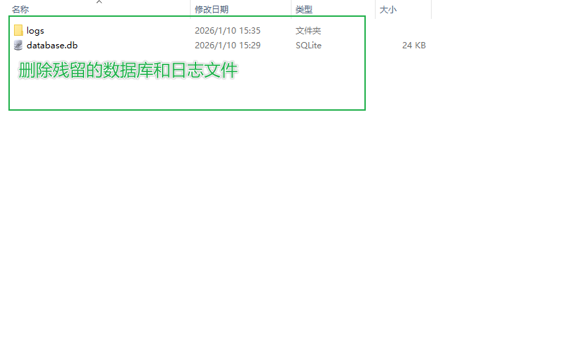
7. **附加说明：一致性验证**
添加或编辑面容界面，有一致性验证，可以验证当前面容和对比面容的一致性。
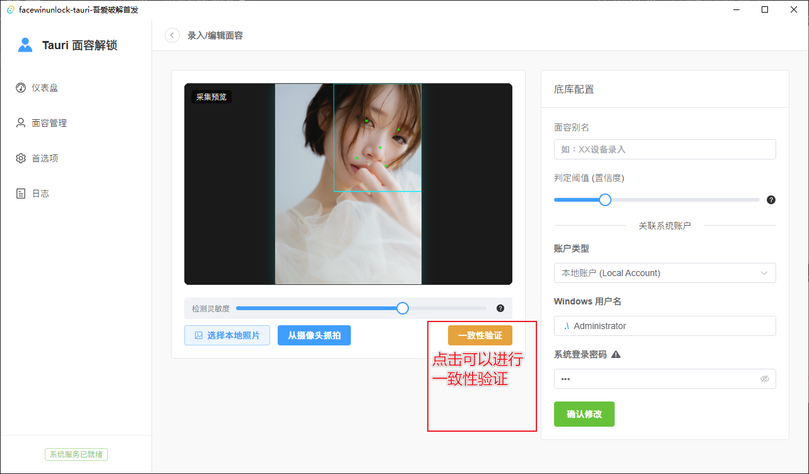
点击后软件将调用摄像头，面容一致性实时显示在右侧。
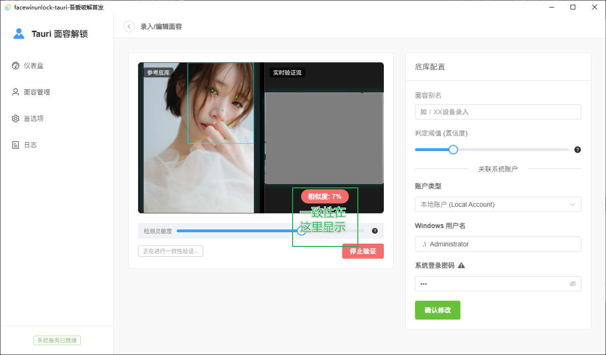
8. **附加说明：性能**
这是面容验证时的系统资源占用情况
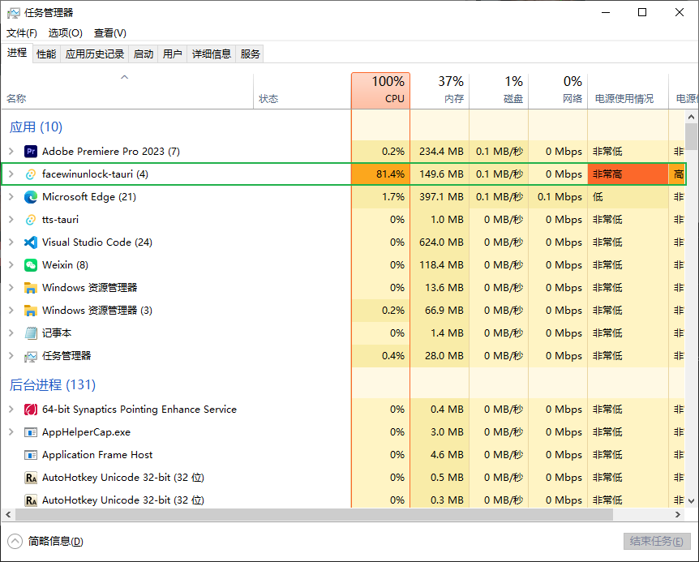
后台程序占用情况
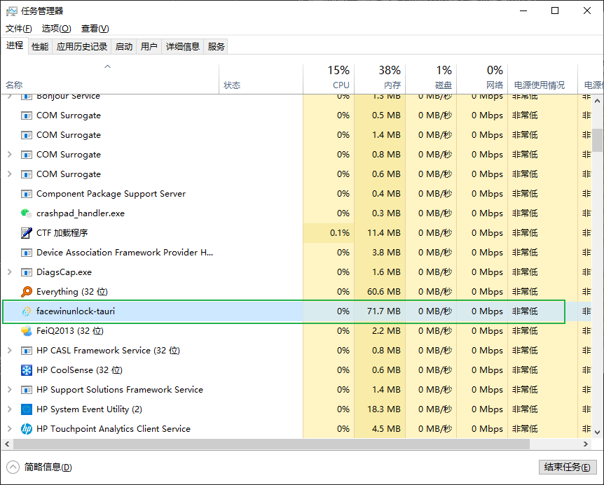
---

## 💡 开发计划 (Roadmap)

* [x] 系统初始化向导
* [x] 实时摄像头人脸录入
* [x] 多面容关联单账户
* [x] 多面容关联多账户（仅在Win10开启Administrator账户的情况下测试成功，Win11测试失败）
* [x] DLL 和软件的个性化配置
* [x] Log 日志查看
* [x] 静默自启
* [x] 本地账号与联机账户支持
* [x] 活体检测（26-1-26完成）
* [ ] 解锁失败时记录最后一帧画面
* [x] 新增应用密码和超时登录机制（26-1-26完成）
* [x] 交互优化：仅在用户有操作时调用面容识别（26-01-18完成）
* [ ] 识别成功后的动态反馈（做不出来了……）

---

## ⚠️ 遗留问题 (Known Issues)

以下是目前开发中遇到的技术瓶颈，欢迎有能力的开发者提交 PR 协助修复：

* **多账户兼容性问题**：在 Win11 非 Administrator 多账户下程序无法正常运行，单个账户没问题，Win10 无此问题。
* **卸载流程简化**：目前缺乏全自动卸载脚本（需编写 NSIS 脚本以实现一键清理）。
* **活体检测缺失**：暂无活体检测算法，现阶段照片可绕过识别，存在安全隐患。
* **锁屏 UI 增强**：受限于 Windows 锁屏界面隔离机制，暂无法实现类似 Win Hello 的原生动画与动态通知。

---

## ✨ 特性

* **现代化 UI**: 基于 Vue 3 + Element Plus 构建，告别传统软件的“土味”界面。
* **系统级集成**: 自动注册 WinLogon 凭据提供程序 (Credential Provider)。
* **双账户支持**: 同时支持本地账户 (Local Account) 与微软联机账户 (MSA) 解锁。
* **轻量级后端**: Rust 后端确保了高效的文件 IO 处理与注册表操作安全性。
* **隐私保护**: 系统凭据通过 SQLite 本地存储，**绝不上传云端**。

---

## 🛠️ 技术栈

* **前端界面**: Vue 3 (Composition API), Pinia, Element Plus
* **后端接口**: Rust (Tauri), Windows API
* **数据库**: SQLite 3
* **面容识别**: OpenCV (人脸检测与特征比对)
* **解锁组件**: 基于 Rust 编写的 WinLogon 注入组件 (Credential Provider DLL)

---

## 📦 代码库结构

* [WinLogon DLL](Server/) - 负责与系统登录界面交互的核心组件。
* [图形化界面](UI/) - 负责面容录入、配置管理的主程序。

---

## ⚠️ 免责声明

本项目涉及修改 Windows 系统内核登录行为。在使用或二次开发时，请务必了解：

1. 错误的操作可能导致系统无法正常登录。
2. 建议在虚拟机 (VMware/Hyper-V) 环境中进行调试。
3. 作者不对因使用本软件导致的任何数据丢失、系统崩溃或安全漏洞承担责任。

---

## 📄 开源协议

本项目采用 [MIT License](LICENSE) 开源。

---

**如果你觉得这个项目有点意思，欢迎点个 ⭐ Star 关注进度！**

---