# FaceWinUnlock-Tauri

**FaceWinUnlock-Tauri** 是一款基于 Tauri 框架开发的现代化 Windows 面容识别解锁增强软件。它通过自定义 Credential Provider (DLL) 注入 Windows 登录界面，结合前端 Vue 3 和后端 OpenCV 人脸识别算法，为用户提供类似 Windows Hello 的解锁体验。

## 下载地址 
[蓝奏云 密码:5969 推荐：不限速、不用登录、不用下载网盘](https://wwbqv.lanzoul.com/b019vlktwf) 

[百度云 提取码: 2ugj](https://pan.baidu.com/s/1UxEflXFxJN6wQBjBbwK9vw) 

[天翼云 访问码：u9gv](https://cloud.189.cn/t/FNvee2mQfumm)

[抖音ID: czm529797 提供的公益站点](https://download.mingqwq.top/)

## 源码说明

因发现市面上有人在盗卖本项目，更有甚者**改个软件名字，就当成自己软件在卖**，多次举报无果。所以从**2026年3月1日**开始，本项目闭源。

上面源码是**0.3.2**版本的，但删除了核心的Rust代码，后续更新仍会通过代码仓库、发布新版本和更新内容，并推送 README.md 文件，但不会再发布新版本源代码。

如果你对程序某一块功能感兴趣，可以提交 issues，我看到后会给你提供一些支持。

## 📖 前言

这个项目的诞生源于一次小小的“心理落差”：

某天，公司新来的同桌入职了，他那台自带红外摄像头的笔记本每次开机只需“看一眼”就能秒进桌面。反观我手里这台性能拉满但摄像头不支持 Windows Hello 的设备，每天还要苦哈哈地敲那一串复杂的密码。

**“凭什么他能刷脸，我不行？”**

秉着“硬件不够，代码凑”的精神，我决定自己动手整一个。既然系统原生不支持普通摄像头面容解锁，那我就自己写一个注入 Windows 登录界面的组件。这就是 FaceWinUnlock-Tauri 的由来——为了让所有带摄像头的 Windows 设备都能体验到这份“优雅”。

## 📝 更新记录
| 版本号 | 更新日期 | 更新内容 | 备注 |
|--------|----------|----------|------|
| v0.1.0 | 2026-01-10 | 初始版本发布 | 支持基础面容录入、多账户解锁、系统初始化向导 |
| v0.1.1 | 2026-01-13 | Bug 修复 | 1. 修复用户名或密码错误时，点击磁贴进入无限循环的bug (#1) 2. 修复不显示页面磁贴时，解锁失败的问题 (#4)  **需要重新初始化**|
| v0.2.0 | 2026-01-19 | 功能添加、Bug修复 | 添加按操作调用面容代码的功能 添加面容识别失败后的重试功能(仅按操作生效) 添加面容禁用功能 (#10) 添加重试时间选项 添加静默自启选项 添加版本号显示 修复DLL设置显示磁贴不管用的bug (#15) 修复核心组件的线程无法安全退出的bug 修复核心组件重复创建凭证类的bug 修复每次修改面容后，缩略图会强制启用的bug 修复笔记本不插电源线时，自启失效的bug 可能修复了所有Win11自启不管用的bug (#16) (#17) 优化缩略图的显示状态提示 优化多开时的显示逻辑（会将程序设为焦点） **需要重新初始化**|
| v0.2.1 | 2026-01-21 | Bug修复、系统增强 | 修复自启不显示窗口的bug 修复在某部分系统上自启不显示托盘的bug 添加密码输入提示 修改重试时间最低为1秒 自启添加失败后的重试机制 **需要重新初始化**|
| v0.2.2 | 2026-01-26 | 功能添加、增强安全性，优化部分UI | 由[@tztztzy提供](https://github.com/tztztzy)提供，代码切换[tztztzy分支](https://github.com/zs1083339604/FaceWinUnlock-Tauri/tree/tztztzy) 增加活体检测功能，模型使用通义实验室的[人脸活体检测模型-RGB](https://modelscope.cn/models/iic/cv_manual_face-liveness_flrgb/summary) 增加应用密码，需要密码才可进入应用，超过设定时间自动要求重新登录，增强安全性 优化一部分UI **需要重新初始化**|
| v0.3.0 | 2026-02-03 | 功能添加、性能优化、Bug修复 | 添加开机面容解锁的支持 (#25) (#18) (#42) (#40) (#30) 添加解锁失败时记录最后一帧画面的功能 添加服务日志 一致性验证添加活体检测逻辑 修复多面容只识别第1个的bug 修复多账户不能用的问题（由[@Xiao-yu233提供](https://github.com/Xiao-yu233)） 修改所有日志为倒序 修复账户输入密码时取消登录，发生的内存泄漏并导致无法正常解锁的bug (#35) 修复账户输入密码时取消登录，引用计数错乱的bug 修复安装到有空格的路径时，开机自启失败的bug (#25) 大幅优化程序的内存占用问题 (#33) (#40) 优化未检测到人脸的提示 增强活体检测的准确性（默认0.6） 更新登录安全的相关功能 (#21) 修复0xc000007b报错问题 (#43) **需要重新初始化**|
| v0.3.1 | 2026-02-07 | Bug修复 | 添加用户名和账户类型修改提示 优化活体检测的准确性 (#56) (#51) (#35) 修复Program目录无法读取和写入数据的bug (#50) (#46) (#44) 修复开机时数据库数据读取异常的bug (#60) (#61) 修复开机时延迟时间解锁不能用的bug (#60) (#61) |
| v0.3.2 | 2026-02-13 | 功能添加、性能优化、Bug修复 | 添加未检测到面容停止识别功能 (#32) (#22) (#73) 添加活体检测开启提示（准确率高后会去除） 添加活体检测时的人脸对齐选项 优化活体检测算法（仍无法与2.2相比） (#64) (#56) (#51) (#35) 修复RAF报错后无法录入人脸的bug (#63) 优化录入人脸未检测到人脸提示 (#58) |
| v0.3.3 | 2026-03-01 | 功能添加、Bug修复 | 添加日志清除功能 (#24) 修复最后一帧图片删除失败无提示的bug 修复摄像头捕捉画面失败后解锁服务停止运行的bug (#84) 修复进入重试时间时，手动解锁再次锁屏后无法解锁的bug 删除维护与卸载中的“保存本地配置”按钮 |
| v0.3.4 | 2026-03-15 | 系统增强、体积优化、Bug修复 | 完成NSIS一键卸载脚本 添加打赏功能 修复没有设置人脸时仍然调用摄像头解锁的bug 修复Win11用户层调用DLL无日志记录问题 修复在应用层、UAC层仍调用面容识别的问题（下版本将支持自定义面容识别层） 解决无限打印日志问题（未从根源上解决） 优化初始化逻辑（初始化可配置摄像头） 代码优化（管道和面容代码复用） 优化dll体积 |
| v0.3.5 | 2026-04-10 | 功能添加、系统增强、Bug修复 | 新增面容解锁场景设置 (#97) (#93) (#87) (#74) 添加Win11对应用层面容解锁的支持 (#87) (#74) 延迟时间添加对重试的支持 优化真的用户名或密码错误的提示 (#45) 完善解锁的动态反馈 (#45) 解锁方式、重试时间移动到了DLL下 修复密码错误后仍然尝试登录的bug (#102) 修复延迟时间无限面容识别的BUG **需要重新初始化** |

---

## 📢 重要通知

> **风险预警：** 由于本项目涉及底层 **注册表修改** 及 **Winlogon 进程操作**，在极端情况下（如 DLL 崩溃、路径配置错误等）可能会导致 Windows 登录界面无法正常显示，甚至**导致无法进入系统桌面**。

> **建议：** 在部署前仔细阅读程序的弹窗通知，并拍照留档，以便出问题后恢复（虽然概率极小）

> **重要提示：** 密码请输入账户中的密码，非Pin码！很多用户是用Pin解锁的，然后在软件输入的Pin码，会提示账户或密码错误。**软件不支持Pin码，请输入账户密码**

> **如果多次提示密码错误，请卸载软件，不要使用，否则微软官方会锁定账户！**

---

## 🎯 适用范围与安全性说明

* **安全性警告**：本项目基于 **2D 面容识别** 技术。相比于 Windows Hello 的 3D 结构光或红外活体检测，2D 识别存在被照片、视频绕过的风险。
* **建议场景**：仅建议在**对安全性要求不高**、追求便捷体验的个人家用电脑或开发机环境使用。**严禁用于存储高机密数据的办公或服务器环境。**
* **系统环境**：Windows 10/11 64位系统（Win7 64位尚未测试）
* **注意事项**：请勿将本软件用于非法用途，如用于非法用途，请自行负责。

---

## 🛠️ 安装与使用

> 在开始之前，请确保你已经阅读并理解了顶部的 **风险预警**。

1. **第一步：系统初始化**
运行软件后，系统会自动检测摄像头权限及注册表环境。强烈推荐在第2步拍照留档，一旦出错方便恢复。
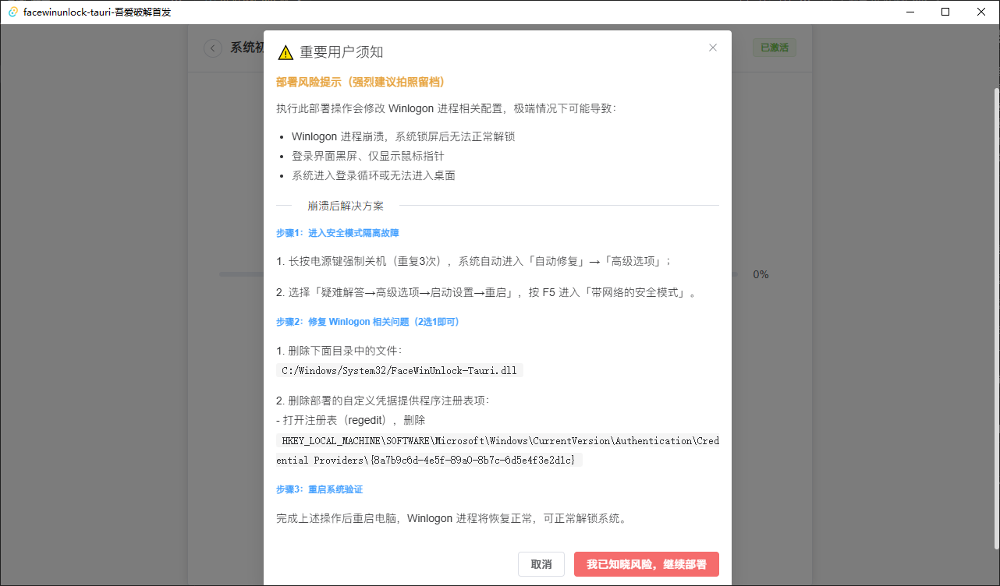
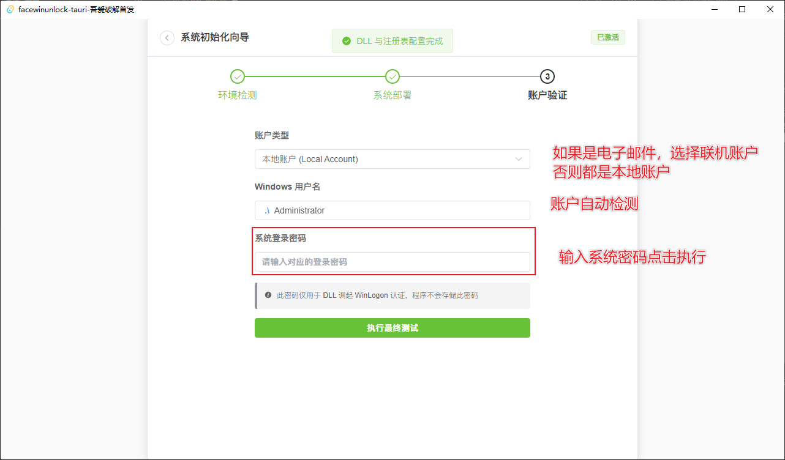
点击执行后，软件会锁定账户，5秒后自动解锁，请勿手动解锁。解锁成功即初始化完成。

2. **第二步：个性化设置**
初始化成功后，点击首选项，选择一个摄像头设备。
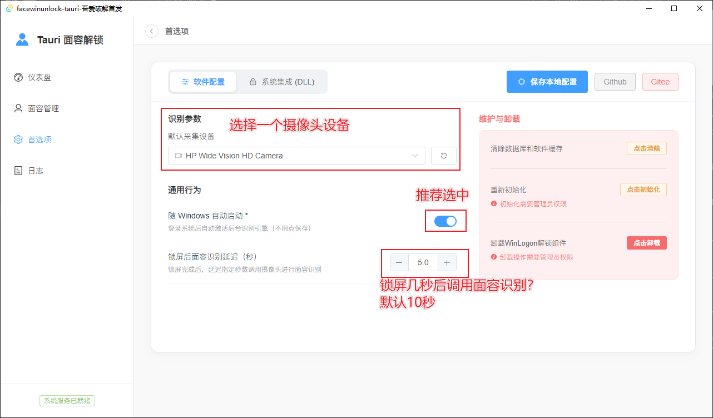
3. **第三步：面容录入**
点击面容管理->添加新面容，即可添加，图片如下：
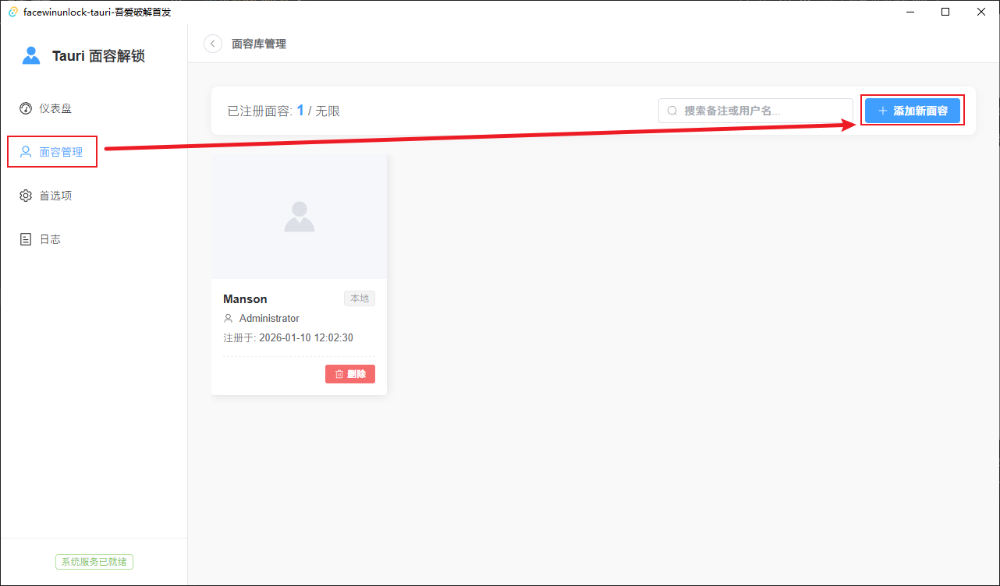
选择下面任意方式添加面容
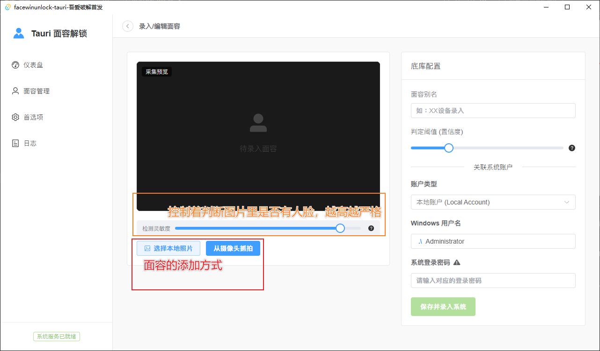
4. **第四步：关联账户**
上一步面容添加成功后，输入别名、Windows账户类型，用户名（自动检查）和密码，点击添加即可完成。
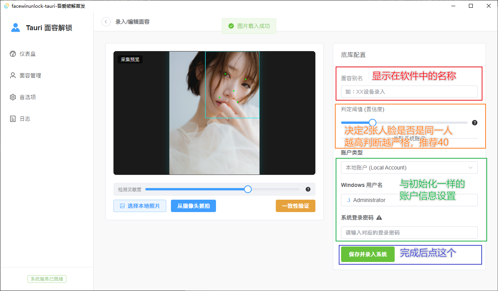
面容列表功能如下图：
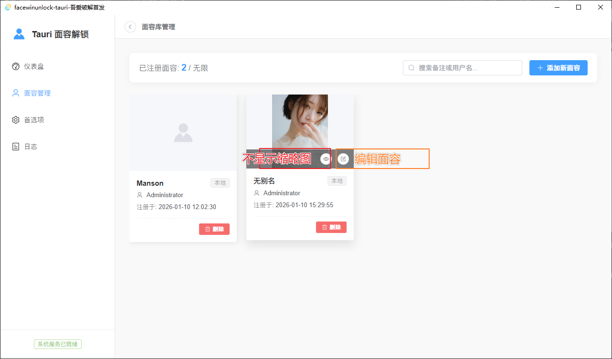
5. **第五步：测试**
按下 `Win + L` 锁定屏幕，滑动鼠标或按键盘（如果你选的延迟时间，请等待相应的秒数），将调用面容识别代码。
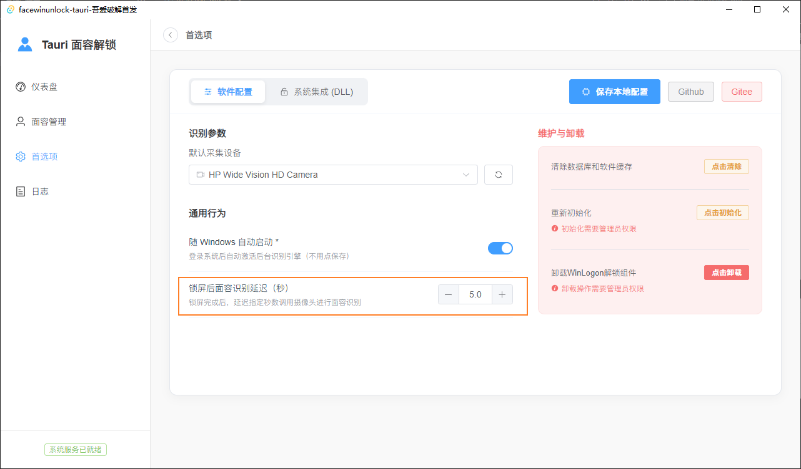
6. **第六步：卸载**
点击首选项->点击卸载核心组件（不走这一步，直接卸载软件会有残留）
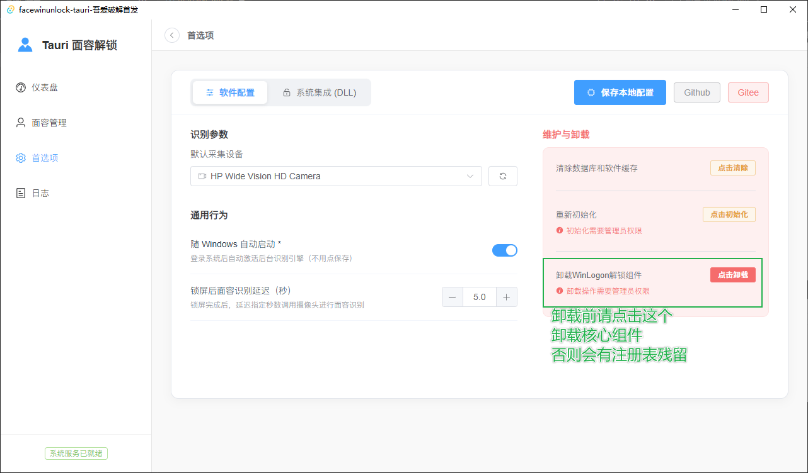
打开软件安装目录的 *uninstall.exe* 卸载主程序即可
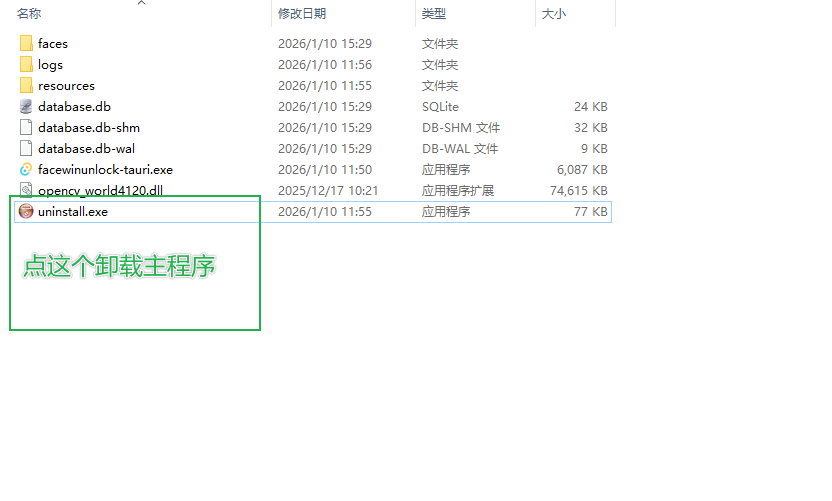
最后删除残留的数据库和日志文件，程序卸载完成，无残留文件。
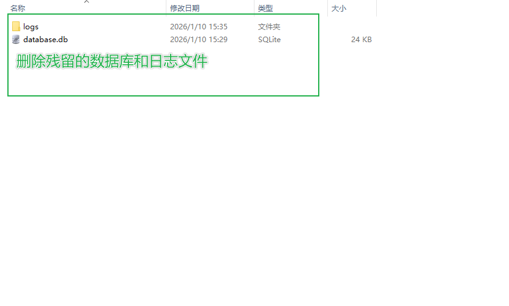
7. **附加说明：一致性验证**
添加或编辑面容界面，有一致性验证，可以验证当前面容和对比面容的一致性。
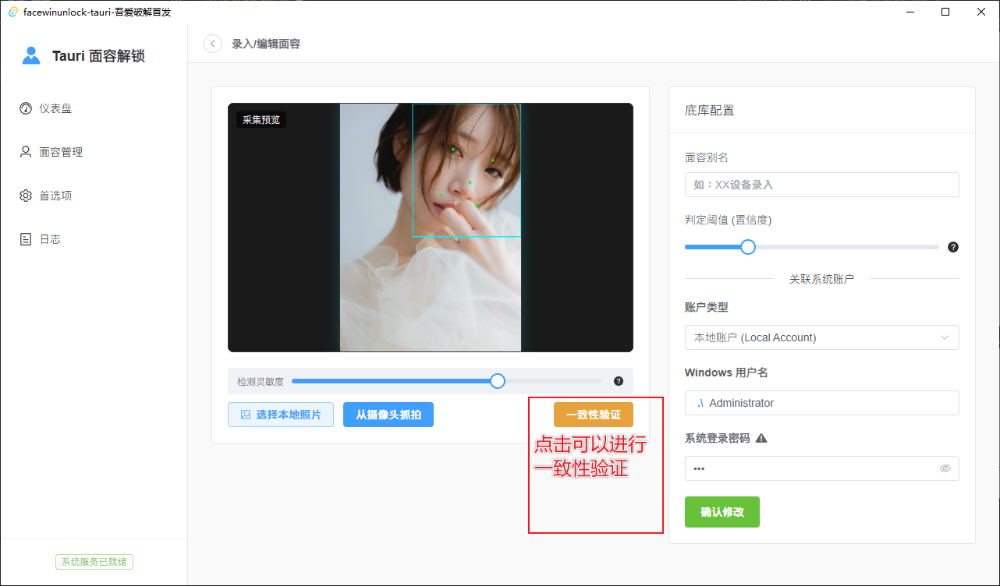
点击后软件将调用摄像头，面容一致性实时显示在右侧。
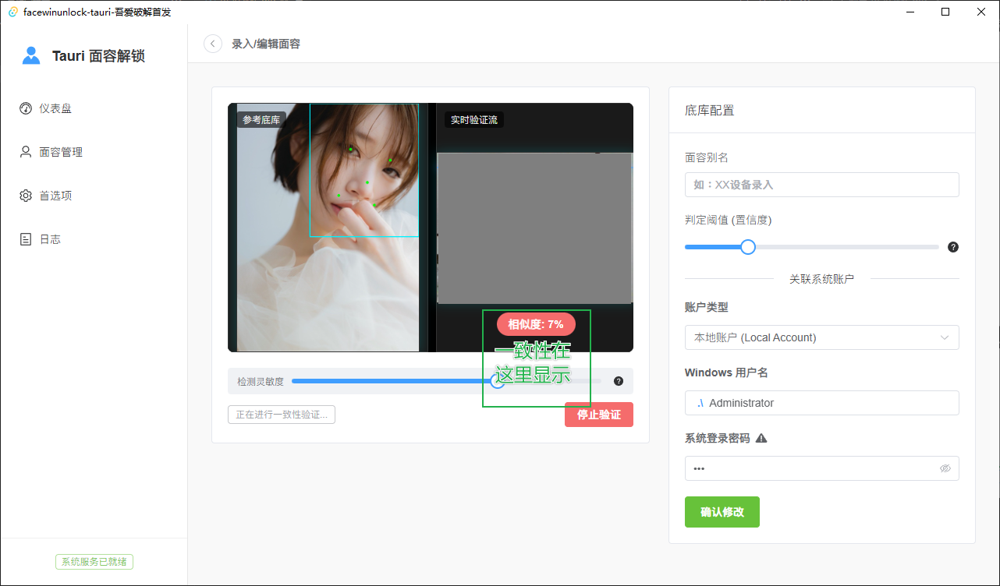
8. **附加说明：性能**
这是面容验证时的系统资源占用情况
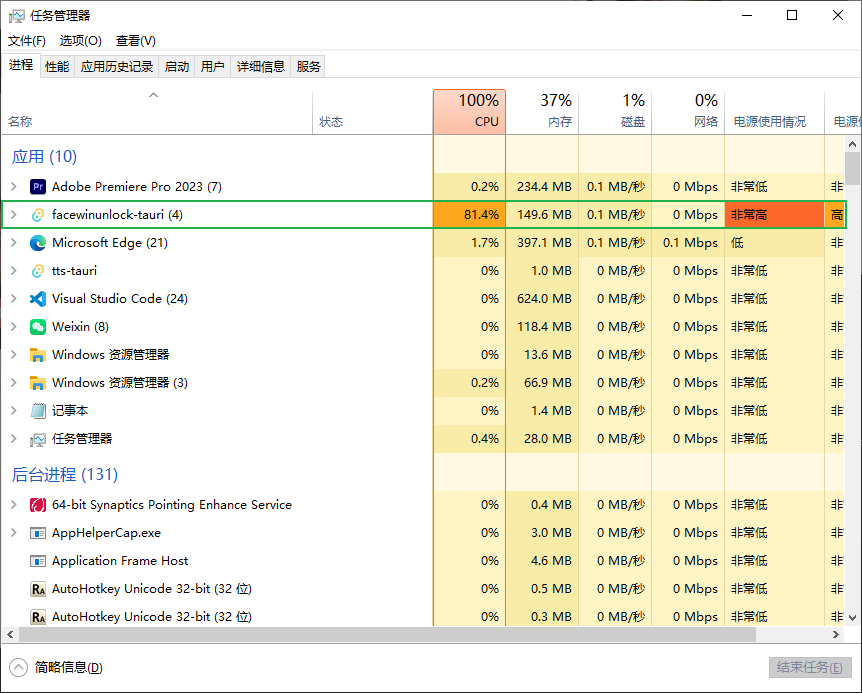
后台程序占用情况
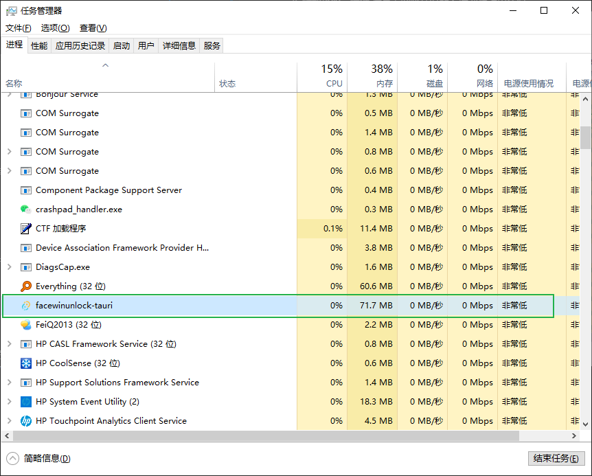

## 💡 开发计划 (Roadmap)

* [x] 系统初始化向导
* [x] 实时摄像头人脸录入
* [x] 多面容关联单账户
* [x] 多面容关联多账户（代码提供者：[@Xiao-yu233](https://github.com/Xiao-yu233)，万分感谢）
* [x] DLL 和软件的个性化配置
* [x] Log 日志查看
* [x] 静默自启
* [x] 本地账号与联机账户支持
* [x] 活体检测 （[@tztztzy提供](https://github.com/tztztzy)）
* [x] 登录安全功能（[@tztztzy提供](https://github.com/tztztzy)）
* [x] 解锁失败时记录最后一帧画面
* [x] 交互优化：仅在用户有操作时调用面容识别（26-01-18完成）

## 后续计划

* [ ] Windows登录凭证加密存储
* [x] 解锁服务的性能优化（13号优化的一次够了，不用在优化了）
* [x] 日志清除功能
* [ ] 解决睡眠、休眠前进行面容解锁的问题
* [x] 无面容时添加超时关闭功能
* [ ] 登录密码找回密码的功能
* [ ] 简化软件缓存清除功能
* [x] 延迟时间支持重试
* [ ] 新的面容识别调用模式
* [ ] 面容解锁分级支持（开机、锁屏、UAC、用户层）
* [ ] 活体检测优化（仍无法与2.2相比，待优化）
* [x] 一键卸载脚本（由claude生成）
* [ ] 检查更新功能（联网的功能暂时不考虑）
* [ ] 识别时的动态反馈（26.02.17完成，样式有待优化）
* [ ] 放弃OpenCV，减少70M体积并解决中文目录无法使用问题（考虑中……）

## ⚠️ 遗留问题 (Known Issues)

以下是目前开发中遇到的技术瓶颈，欢迎有能力的开发者提交 PR 协助修复：

* **锁屏 UI 增强**：受限于 Windows 锁屏界面隔离机制，暂无法实现类似 Win Hello 的原生动画与动态通知。（26.02.17进行了优化，但还不够）

## ✨ 特性

* **现代化 UI**: 基于 Vue 3 + Element Plus 构建，告别传统软件的“土味”界面。
* **系统级集成**: 自动注册 WinLogon 凭据提供程序 (Credential Provider)。
* **双账户支持**: 同时支持本地账户 (Local Account) 与微软联机账户 (MSA) 解锁。
* **轻量级后端**: Rust 后端确保了高效的文件 IO 处理与注册表操作安全性。
* **隐私保护**: 系统凭据通过 SQLite 本地存储，**绝不上传云端**。

## 🛠️ 技术栈

* **前端界面**: Vue 3 (Composition API), Pinia, Element Plus
* **后端接口**: Rust (Tauri), Windows API
* **数据库**: SQLite 3
* **面容识别**: OpenCV (人脸检测与特征比对)
* **解锁组件**: 基于 Rust 编写的 WinLogon 注入组件 (Credential Provider DLL)

## 📦 代码库结构

* [WinLogon DLL](Server/) - 负责与系统登录界面交互的核心组件。
* [图形化界面](UI/) - 负责面容录入、配置管理的主程序。
* [解锁服务](Unlock/) - 负责处理解锁请求，与 WinLogon DLL 交互。
* [管道库](windows_pipes/) - 为上面3个的管道使用提供接口。
* [面容识别](face_library/) - 为解锁服务和图形化界面提供面容识别功能。

## ⚠️ 免责声明

本项目涉及修改 Windows 系统内核登录行为。在使用或二次开发时，请务必了解：

1. 错误的操作可能导致系统无法正常登录。
2. 建议在虚拟机 (VMware/Hyper-V) 环境中进行调试。
3. 作者不对因使用本软件导致的任何数据丢失、系统崩溃或安全漏洞承担责任。

## 📄 开源协议

本项目采用 [GNU Affero General Public License v3.0](LICENSE) 开源。

---

**如果你觉得这个项目有点意思，欢迎点个 ⭐ Star 关注进度！**
